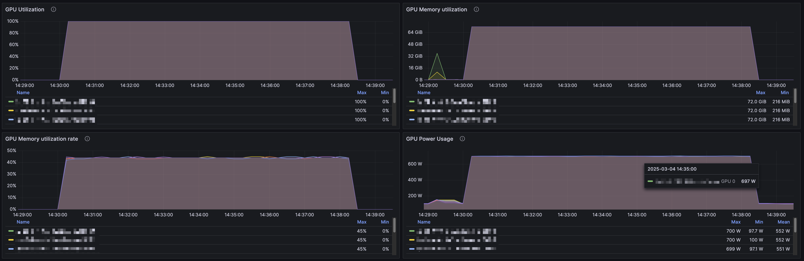
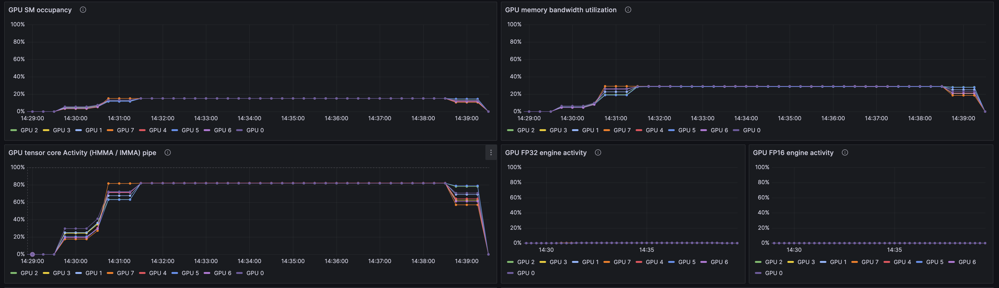

# GPU fryer 🍳

GPU fryer is a tool to stress test GPUs and detect any abnormal thermal throttling or performance degradation.
It is especially useful to test GPUs running ML inference or training workloads for which
performances are dictated by the slowest GPU in the system.

We use it at [Hugging Face](https://huggingface.co) 🤗 to monitor our HPC clusters and ensure that all GPUs are running at peak performance.


## Quickstart

Use Docker:

```bash
# You need a system with NVIDIA GPUs and driver ≥ 575.57.08
docker run --gpus all ghcr.io/huggingface/gpu-fryer:1.0.0 60
```

## Usage

```
$ gpu-fryer 60  # Run the test for 60 seconds
...
GPU #7:  51494 Gflops/s (min: 50577.53, max: 51677.05, dev: 51493.79)
         Temperature: 48.83°C (min: 47.00, max: 50.00)
         Throttling HW: false, Thermal SW: false, Thermal HW: false
All GPUs seem healthy
```

```
Usage: gpu-fryer [OPTIONS] [DURATION_SECS]

Arguments:
  [DURATION_SECS]  Duration in seconds to burn the GPUs [default: 60]

Options:
      --nvml-lib-path <NVML_LIB_PATH>
          Path to NVIDIA Management Library (libnvidia-ml.so) [default: /usr/lib/x86_64-linux-gnu/libnvidia-ml.so.1]
      --tolerate-software-throttling
          Tolerate software throttling if the TFLOPS are in the acceptable range
      --tflops-tolerance <TFLOPS_TOLERANCE>
          TFLOPS tolerance (%) compared to best GPU If the TFLOPS are within `tflops_tolerance`% of the best performing GPU, test will pass [default: 10]
      --use-fp32
          Use FP32 precision. If unset, will use FP32 if no GPUs support BF16 or FP8
      --use-bf16
          Use BF16 precision. GPU must support BF16 type. If unset, will use BF16 only if all GPUs support it
      --use-fp8
          Use FP8 precision. GPU must support FP8 type
  -h, --help
          Print help
  -V, --version
          Print version
```

GPU fryer relies on NVIDIA's CUDA toolkit to run the stress test, so make sure
that your PATH includes the CUDA libs.
NVML is used to monitor the GPU's temperature and throttling, in case of non default
installations, you can use the `--nvml-lib-path` flag to specify the path to `libnvidia-ml.so`.

GPU fryer checks for homogeneous performance across all GPUs in the system (if multiple GPUs are present) and reports
any performance degradation or thermal throttling.
There is currently no absolute performance metric. For reference:

| GPU                   | TFLOPS | Precision |
|-----------------------|--------|-----------|
| NVIDIA H100 80GB HBM3 | ~51    | FP32      |
| NVIDIA H100 80GB HBM3 | ~676   | BF16      |
| NVIDIA GH200 480GB    | ~363   | FP32      |
| NVIDIA GH200 480GB    | ~705   | BF16      |
| NVIDIA GH200 480GB    | ~1660  | FP8       |

## Installation

```bash
$ cargo install gpu-fryer
```

## How it works

GPU fryer creates two 8192x8192 matrix and performs a matrix multiplication using CUBLAS.
Test allocates 95% of the GPU memory to write results in a ring buffer fashion.

If GPU is BF16 capable, it will use BF16 precision instead of FP32 to stress the Tensor Cores.
You can also use FP8 precision if the GPU supports it, you will get higher TFLOPS but likely less GPU power draw (not
recommended for a throttling test).

With a 8xNVIDIA H100 80GB HBM3 system, we get the following results:




## Acknowledgements

The awesome [GPU Burn](https://github.com/wilicc/gpu-burn), very similar tool but looking at computational errors.